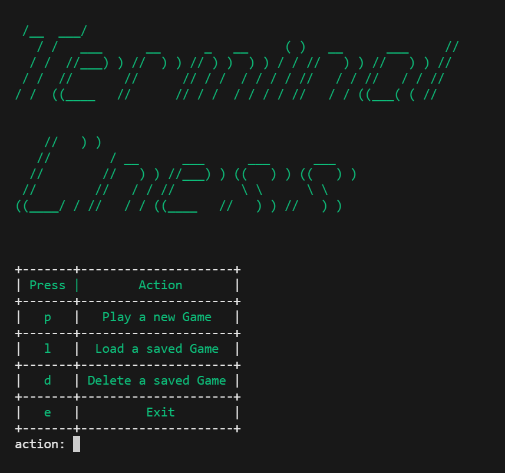
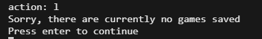
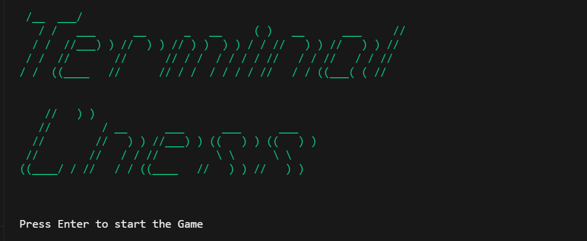
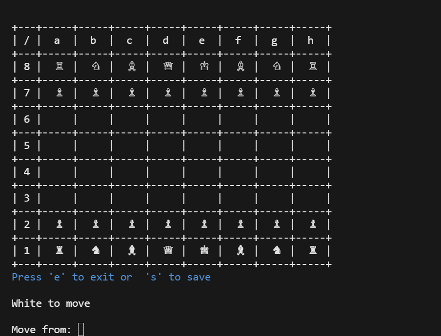
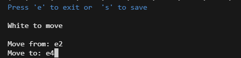
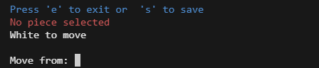
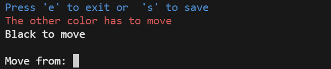
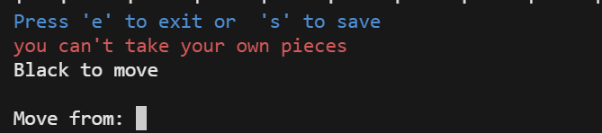
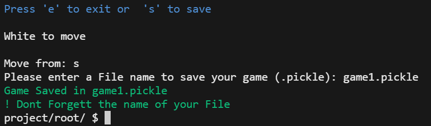
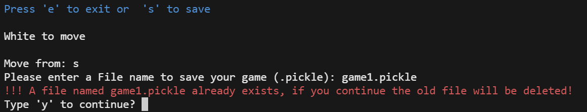

# Terminal Chess

#### Video Demo:
[Terminal Chess Game](https://www.youtube.com/watch?v=uPArRznj5iE&ab_channel=FynnSchneider)
#### Description:

Terminal Chess is a program that allows the user to play a game of chess in his console.

#### User Experience
First, the user is shown a menu screen where he can choose between 4 different options. He can play a new game by typing "p", load an already saved game by typing "l", delete an already saved game by typing "d", or exit the program by typing "e".

  

If no game is currently saved, it is not possible to load or delete a saved game. Instead, the user is shown an error message if he tries to do so.

  

If there are games that the user can load or delete, a list of these games will be displayed and the user is exspected to choose one of the shown file names. If he inputs anything other than one of the displayed file names, he will simply be asked again.

  

If the user decides to start a new game by typing 'p', a start screen will be displayed,

  

pressing enter will start the game and the game board will be displayed.

  

The program expects the user to enter a start square from which they want to move a piece and then an end square to which they want to move. Therefore, it only accepts input from a1 (bottom left) and h8 (top right).

  

After receiving the inputs, the program performs some tests and checks the inputs, which can lead to the following results:

1. the user inputs a start field that does not contain a piece

    

  

1. the user tries to move a piece of the wrong color

    

  

3. the user inputs an end field that contains a piece of the same color

    

  

4. the user inputs an end field that cannot be reached by the piece

    

  

5. the user inputs an end field which can normally be reached by the piece,
    but whose path is blocked by other figures

    

  

6. the user inputs an valid move

  

After each valid move, the piece moves, the board gets updated, and the color of the pieces that can move are changed and the user can now input a move for this color.

If the move inputted results in a pawn reaching the last rank, the program displays a list of pieces to which the pawn can promote to and expects the user to select one of them. The pawn then transforms into the selected piece.

During the game, the user always has two options. To exit the program by entering 'e', which ends the program without saving the current game. Or to save the current game by entering 's'. You will be asked for the file name under which the current game is to be saved. The selected file must be in .pickle format. If the user enters an invalid file format, he will receive an error message and will be asked again.

  

If the user enters a correct file, the game is saved.

  

and the program exits. However, if the user enters a file name that already exists, he must confirm again whether he wants to replace the old game with the new one.

  

### Currently not suported are:

1. Castling
2. en passant
3. automated detection of whether the king is in check or checkmate

  

## **Code**
### project.py
---

Shows the main menu and takes care of its functionality.

####  main()

validates the user's input and executes the respective action.

#### print_menu()

creates the title, the table with the possible selection options and displays them in the terminal.

#### show_saved_games()

Displays all files in the saved_games folder or an error message if there are no files in this folder.

#### load_game()

Expects a filename and tries to read the game data. If this is successful, the function game.load_game() is executed and the game data is passed as a parameter.

#### delete_game()

Expects a filename that exists in the saved_games folder and deletes the game data.

  

### game.py
---
Shows the board, receives moves, validates the moves and executes them. Is also responsible for loading and saving games.

#### Pieces
Instances of the corresponding pieces for all pieces on the board.

2 Kings, 2 Queens, 4 Rooks, 4 Bishops, 4 Knights, 16 Pawns, of which half are white and half are black

#### current_position
Saves the position of all the pieces on the current board.

#### field_convertion_dict
Saves the corresponding idices to the current_position list for each allowed user input.

#### color_to_move
Saves which color can currently move.

#### error_message
Saves the error message which recently occured to diplay it when the board gets updated.

#### main()
Shows the start menu of the game and executs the make_a_move function until the user wants to leave the game.

#### print_start_menu()
Prints the Title to the terminal and waits for the user to start the game by hitting enter

#### make_a_move()
Promts the user to input a start and end field.

Validates the format of the input and converts it to the corresponding indeces.

Validates if a piece is selected, if the selected piece has the right color, and if there is a same colored piece on the end field.

Checks if the selected piece is a pawn and if so executes the try_to_move_pawn function of the selected pawn object and starts the make_a_move funcion again.

If the selected piece is not a pawn it executes the move_to() function of the selected piece object.

Checks if there are any other pieces on the fields the selected piece has crossed during its move. If so its postion gets reset to the start position and the make_move function starts again.

If the move passed all validations the commit_the_move() function gets executed

#### commit_the_move()
Updates the current_position list, so that the moved piece is now on the selected end field, and the selected start field is empty.

Changes the color of the pieces that can move now

#### print_board()
Makes a table with all the rowes saved in current_position and shows it on the terminal.

Shows the info and error messages and shows which color can move

#### save_game()
Prompts the user to input a file name where he wants to save his game to.

Validates the format.

Checks if the file already exists and asks the user to confirm his action if so.

Creates a dictionary which saves the current_position and the color_to_move

Creates a new file in the saved_files directory and saves the dictionary as a .pickle file

#### load_game()
Takes a position and sets the current_position to it.

Takes a color who can move in the next move and sets it to color_to_move.

Starts the main() with the new Attributes saved

  

### pieces.py
---

Contains a Pieces class, which is used as a parent class for all pieces. Validates the possible moves of the individual pieces and keeps track of important informations about each piece

#### Class Variables

#### possible_fields
A list of all fields a piece can access

#### move_pattern_dict
Contains the corresponding move_patterns to every piece_type

#### icon_dict
Contains the corresponding icon to every piece_type of every color

  

#### Properties

#### crossed_fields_from_last_move property and setter
Saves all the fields the piece has crossed during its last move

Dosnt allow to set the value of crossed_fields_from_last_move

Value should only be set be get_crossed_fields_from_last_move function which accesses _crossed_fields_from_last_move directly

#### position property and setter
Saves the current position of the piece.

Validates if a piece can reach the new position from its current one bevore setting it by calling try_to_move_piece()

#### icon property and setter
Saves the icon of the piece.

Makes it only possible to set the icon once

#### color property and setter
Saves the color of the piece.

Makes it only possible to set the color once

#### piece_type property and setter
Saves the piece_type of the piece.

Makes it only possible to set the piece_type once

#### move_pattern property and setter
Saves the move_pattern of the piece.

Makes it only possible to set the move_pattern once

  

#### Methods

#### try_to_move_piece()
checks if the new position can be reached from the current possition if the piece only follows its move pattern

#### get_crossed_fields_from_last_move()
Shortens the move which was done by the piece, so that the piece only moves one field at a time.

Adds the shortend move to the start field until the end field is reached.

Tracks all the crossed fields on this way and sets _crossed_fields_from_last_move to a list of this fields.

#### __init__()
Sets the value of move_cout to 0.

Sets the passed values from the child class (piece_type, move_pattern, color, icon).

#### __str__()
Returns the icon of the piece when it gets called.

Is used to show the icon of the piece in the console whenever the object gets printed.

  

### pawn.py
Contains a Pawn class, which inherits from the Pieces class. Handels the movement of the pawn, because its different from all the other pieces movement.
--

#### __init__()
Calls the \__init__ function of the parent class and passes all the necessary information to it.

#### try_to_move_pawn():
checks how the pawn wants to move.

If the pawn wants to move two fields forward, it checks if the pawn has already been moved and if there are any other pieces in the way. If not he moves.

If the pawn wants to move one field forward, it checks if there are any other pieces in the way. If not it moves.

If the pawn wants to move one field diagonal, it checks if there is a piece with a different color then its own. If so he moves.

If he wants to move to a different field or if any of the validations above were invalid, it returns an error

#### pawn_move():
Takes a piece as parameter.

Checks if the piece is equal to itself. (Should protect the uninteded change of _position)

If so it sets the position of itself to a new position and increases the move_count by one

#### check_for_promotion():
Checks if the pawn is on the last rank.

If so it promts the user to input a Piece he wants to promote to.

A new piece of the selected type and with the same color as the pawn gets initialized and placed on the pawn position

  

## Unity Test

  
### ! The Unity Test can only be run successfully if your 'saved_files' Folder is empty

#### It tests if:
1. an error message is displayed when the user tries to load a game when there are no games saved **(test_show_saved_games())**
2. an error message is displayed when the user tries to delete a game when there are no games saved **(test_show_saved_games())**
3. the game can get started **(test_start_and_save_game)**
4. a valid series of moves can be played **(test_start_and_save_game())**
5. a played game can be saved **(test_start_and_save_game())**
6. the saved game files are shwon when trying to load a game **(test_load_game_show_saved_games())**
7. the above saved game can be **(loaded test_load_game())**
8. the game can be exited from the menu and from the game **(test_exit_from_menu(), test_exit_from_game())**
9. an error message is display when the king makes an invalid move **(test_king_movement_invalid())**
10. an error message is display when the queen makes an invalid move **(test_queen_movement_invalid())**
11. an error message is display when the rook makes an invalid move **(test_rook_movement_invalid())**
12. an error message is display when the bishop makes an invalid move **(test_bishop_movement_invalid())**
13. an error message is display when the knight makes an invalid move **(test_knight_movement_invalid())**
14. the king can make a series of valid moves **(test_king_movement_valid())**
15. the queen can make a series of valid moves **(test_queen_movement_valid())**
16. the rook can make a series of valid moves **(test_rook_movement_valid())**
17. the bishop can make a series of valid moves **(test_bishop_movement_valid())**
18. the knight can make a series of valid moves **(test_knight_movement_valid())**
19. the pawn can move two fields if it is his first move **(test_pawn_movement_two_fields())**
20. the pawn can move only one field straight forward **(test_pawn_movement_one_field())**
21. the pawn can only move diagonal foward if he captures a piece by doing so and can't capture a piece by moving straight forward **(test_pawn_movement_colliding())**
22. a pawn promotes properly when reaching the last rank **(test_pawn_promotion())**
23. the crossed fields function from the Piece class returns the correct list of crossed fields **(test_crossed_fields_from_last_move())**
